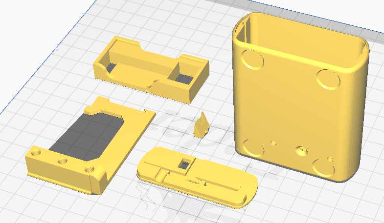

# Print instructions

No supports needed when printing at 0.2mm layer height.

When printing the case, align seams on the bottom.

Rear panel with 0.0mm clearance is a snap fit on my printer.

Display spacer is optional in case you have problems with the display
bending, it can be jammed behind the display.

# Changelog

* 29/11/2025 initial release for V4.1 PCB