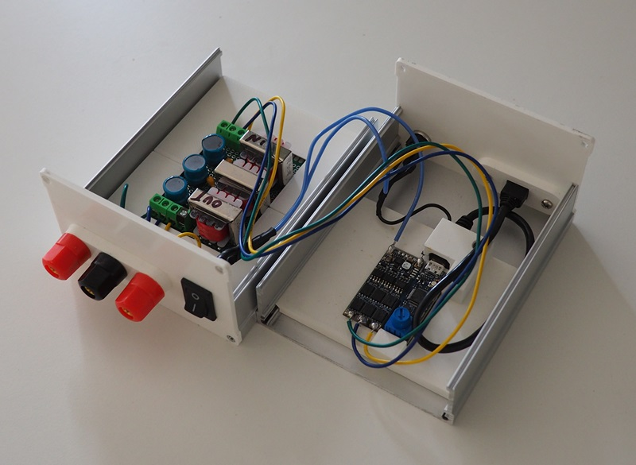
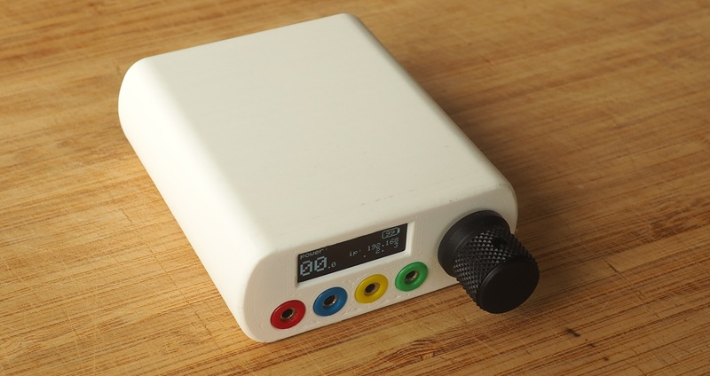

FOC-Stim is a family of next-generation estim devices that generate current-controlled analogue waveforms.
It can be controlled with [Restim](https://github.com/diglet48/restim).

Unlike traditional devices, the FOC-Stim has no channels
but offers an any-to-any output topology.

# Version 1

Version 1 has 3 outputs. It uses a three-phase motor drive development kit from ST (the [B-G431B-ESC1](https://www.st.com/en/evaluation-tools/b-g431b-esc1.html)) for control. It only support three-phase output.

It is fairly easy to build with basic soldering skills, all parts can be ordered from mouser. For more information see [docs/focstim-v1.md](docs/focstim-v1.md)

# Version 4

Version 4 uses a custom PCB. It improves the original by adding one extra output, a battery, and wireless comms.

See [docs/focstim-v4](docs/focstim-v4.md) for more info.
