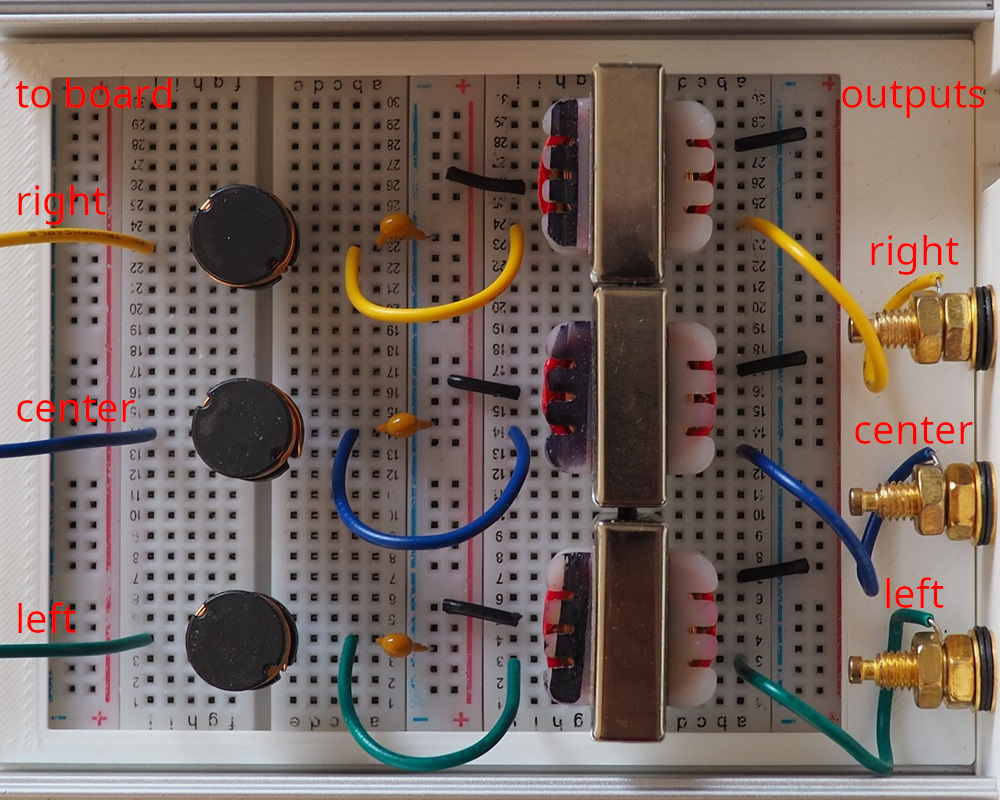

FOC-Stim is an implementation of the [Restim](https://github.com/diglet48/restim) threephase signal generation algorithm
for the [B-G431B-ESC1](https://www.st.com/en/evaluation-tools/b-g431b-esc1.html) electronic speed controller.

FOC stands for Field Oriented Control, an algorithm for controlling motors, referencing the intended purpose of the hardware.

It utilizes MRAC (model reference adaptive control) to generate consistent current-controlled waveforms
as environment conditions change.

# Hardware setup

For component selection, refer to the [Bill of materials](docs/BOM.md).

How to wire:

`U`, `V`, `W` are the 3 outputs on the board, with `U` being the one closest to the potentiometer.

The side of the transformer marked with black sharpie should be connected to the board-side.
The primary, indicated with a "P", is the output side.

# Software setup

From the factory, the board has a very old ST-link firmware that prevents the usb-serial from working
correctly on some computers. It is highly recommended to update the ST-link firmware using
[STM32CubeProgrammer](https://www.st.com/en/development-tools/stm32cubeprog.html) before proceeding.

Install Visual Studio Code with plugins `platformio` and `teleplot`,
then build and upload the firmware, instructions below.

Inspect `FOC-Stim/src/config.h` to configure the current limits.

# Control

Control over USB with Restim.

View live stats with teleplot.

The onboard pot can be used to control the signal intensity.
If you only want to use software control, turn it all the way clockwise.
You can desolder the pot and use the pins to wire an external pot for your box.

All restim features are supported except: vibration.
