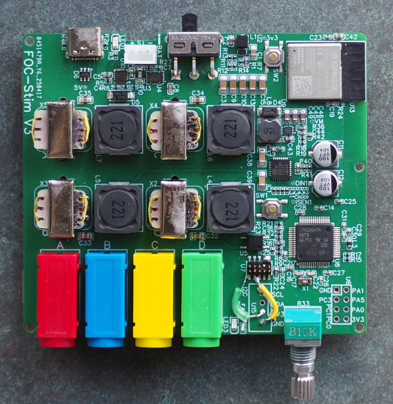
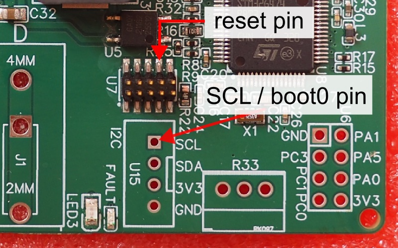
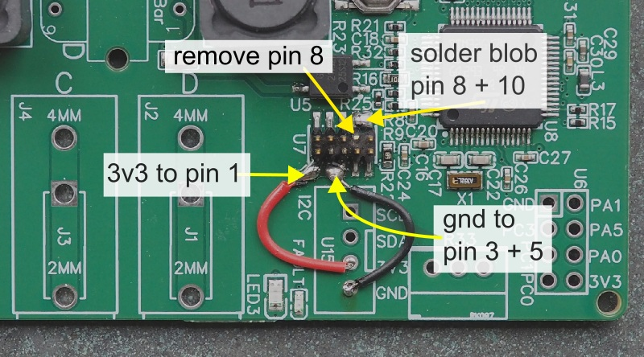

> [!CAUTION]
> Only applicable to FOC-Stim V3, not V3.1 or later.

# Soldering

* 4x transformers
* 4x 4mm bullet connectors (red, blue, yellow, green)
* 1x potmeter (optional)
* 1x jst-ph 2.0mm (optional, for battery. No reverse voltage protection!!!)

# Flashing the ESP32

All V3 boards I sent out came with the ESP32 firmware pre-programmed.

# Flashing the STM32 (serial)

Due to various hardware bugs, the STM32 crashes on boot. Extra steps are needed to boot normally or enter the bootloader.

**To enter the bootloader:** turn on the power, then briefly short the reset pin to ground.

In the bootloader, the firmware can be programmed with STM32CubeProg. (default settings, 115200 baud, RTS/DTR low).

You must program the .elf file, not the .bin file. The .bin file does not work due to split memory bank architecture of the 128Kb chips.

If you get an error reading the option bytes, this appears to be a bug in the STM32CubeProgrammer GUI. You can fix it with this command: `.\STM32_Programmer_CLI.exe -c port=COM4 -e all`. (replace COM4 with your board COM port).

**To start the board:** short the SCL / Boot0 pin to ground before flipping the power switch. If done succesfully, one of the LEDs will turn on.

# Flashing the STM32 (jtag debugger)

Ensure your V3 board has the required patches.

Upload the .elf firmware using your debug probe. I use segger J-Link with ozone debugger, but STM32CubeProgammer works too.

A hardware bug prevents the firmware from starting normally. Use one of these methods to start the firmware:
* Use the ozone debugger to 'reset program to main (F4)'.
* Short the SCL pin to ground, then reboot the board by shorting the reset pin or flip the power switch.
* Use STM32CubeProgrammer to set option bit `nSWBOOT` to 0. You can then boot the board normally. Only do this if you have a jtag probe!

# Battery

To run the system from battery, the fuel gauge first needs to be programmed. The firmware does this on boot, provided you did not short SCL / Boot0 to ground.