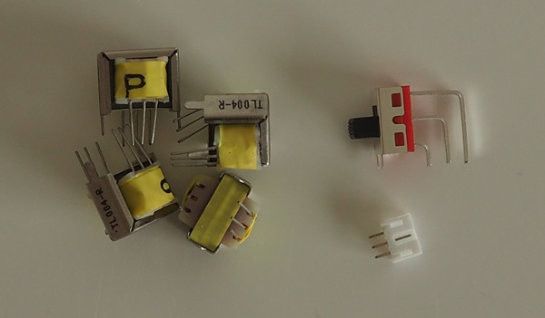
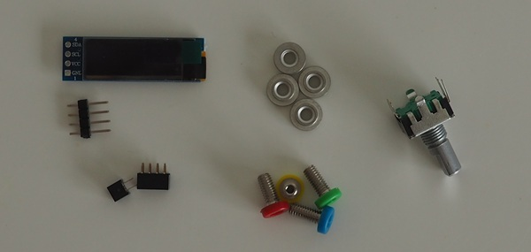
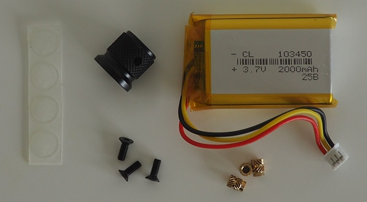

# PCB

Mainboard from JLCPCB, one-sided assembly.  
Frontpanel from JLCPCB, no assembly.  

# Mainboard components

### Transformer
4x Xicon 42TL004-RC. [Mouser](https://mouser.com/ProductDetail/Xicon/42TL004-RC?qs=%252BLh6ltJumVRX87vpOY3zCA%3D%3D)

Alternatives, not tested:  
42TL004-RC on ebay, a knockoff without the xicon brand, but very close to the original.  
Xicon 42TL001-RC. 5-10% lower battery life with 20% higher output power.

### Switch
XKB Connection SS-12D28G5. [LCSC](https://www.lcsc.com/product-detail/C1121878.html)  
alternative part: SS-12D28L5  

### Battery connector
JST B3B-PH-K-S(LF)(SN) [LCSC](https://www.lcsc.com/product-detail/C131339.html), [Aliexpress](https://aliexpress.com/item/1005004393386300.html)

# Frontpanel components

### Display
HS HS91L02W2C01. [LCSC](https://www.lcsc.com/product-detail/C5248081.html)  
Alternative part: search for SSD1306 I2C 128x32 0.91 OLED Display. Make sure dimensions are 12x38mm, monochrome (1-color). Not recommended because every display has the actual display area in a slightly different spot. [Aliexpress](https://aliexpress.com/item/1005005301005280.html)

### 2.54mm 1x4 header, male
For the display. Cut off length that you need. [Alixpress](https://aliexpress.com/item/1005009749780893.html)

### 2.0mm 2x2 header, female
[Aliexpress](https://aliexpress.com/item/1005006954403874.html)  
[LCSC](https://www.lcsc.com/product-detail/C41417314.html)  

### 2.0mm 2x4 header, female
[Aliexpress](https://aliexpress.com/item/1005006954403874.html)  
[LCSC](https://www.lcsc.com/product-detail/C41417316.html)

### SMD nut
Equivalent parts, pick one:  
4x SMTSO-M4-2ET [Aliexpress](https://aliexpress.com/item/1005003780208153.html)      
4x SMTSO-M4-2ET [Mouser](https://mouser.com/ProductDetail/PEM/SMTSO-M4-2ET?qs=l4Gc20tDgJJftsdplEey1w%3D%3D)  
4x SMTSOM420BTR [LCSC](https://www.lcsc.com/product-detail/C49236416.html)  
4x SMTSOM420STR [LCSC](https://www.lcsc.com/product-detail/C49236401.html)  

### 2mm banana jack with 4mm thread, 4 colors (red, blue, yellow, green)
[Aliexpress](https://aliexpress.com/item/1005006083045067.html),
[Aliexpress 2](https://aliexpress.com/item/1005008667160927.html)

The manufacturer is Changzhou Amass Electronics, product 24.106.1 (red)
    
### Encoder
Bourns PEC11R-4015F-S0024 (metal shaft, button, no detents, 24 pos) [LCSC](https://www.lcsc.com/product-detail/C143789.html), [Mouser](https://mouser.com/ProductDetail/Bourns/PEC11R-4015F-S0024?qs=Zq5ylnUbLm4l0nvCUCX4Xw%3D%3D)

Alternatives:  
Bourns PEC12R-4020F-S0024 (plastic shaft, button, no detents, 24 pos) [LCSC](https://www.lcsc.com/product-detail/C22466590.html), [Mouser](https://mouser.com/ProductDetail/Bourns/PEC12R-4020F-S0024?qs=Zq5ylnUbLm43qafljSxq%252Bw%3D%3D)  
aliexpress knockoff: https://aliexpress.com/item/1005007798682136.html, 19mm. Open the pot and reverse the spring to eliminate detents before soldering. Not as smooth as the others.

The threads/nut on the pot are not used.
A pot with detents can be used, but I prefer the smooth ones due to the higher resolution.

# Misc

### Encoder knob
My favorite: 
[Aliexpress](https://aliexpress.com/item/1005007470191877.html), 
[Aliexpress 2](https://aliexpress.com/item/1005007412387621.html),
[Aliexpress 3](https://aliexpress.com/item/1005008690035040.html)

Alternative style: [Aliexpress](https://aliexpress.com/item/1005007065833808.html)

6mm D-shaft. A knob with fairly aggressive knurling is required for one-finger operation. Max size approx 20mm.

### Non-slip feet

Round, 10mm diameter sticky feet
[Aliexpress](https://aliexpress.com/item/1005007646422189.html) (transparent) 
[Aliexpress 2](https://aliexpress.com/item/1005005667108142.html) (white or black)  

### M3 heatset insert
3x M3 heatset insert, designed for 4mm hole. Max length 6mm.

M3x6x4.5 [Aliexpress](https://aliexpress.com/item/1005004629314742.html), [Aliexpress 2](https://aliexpress.com/item/1005003582355741.html)  
M3x5.7 [CNC kitchen](https://cnckitchen.store/products/heat-set-insert-m3-x-5-7-100-pieces) (not tested)   
IUTB-M3 [Mouser](https://mouser.com/ProductDetail/SI/IUTB-M3?qs=7MVldsJ5Uay0LzKdLqXQgg%3D%3D) (not tested)  

### M3 screw

M3 countersink, length 4mm to 10mm. Optional accessories may require longer bolts.

TODO: sourcing link for this part

### Battery
A battery is optional.

34mm * 50mm. Maximum thickness 10mm. **Must be 3-pin JST-PH**.  
[Aliexpress](https://aliexpress.com/item/1005009218475835.html) slow shipping, [Aliexpress](https://aliexpress.com/item/1005003253170704.html) faster shipping,  
[ebay](https://www.ebay.com/itm/113697231078)  
[Amazon](https://www.amazon.com/dp/B09GKF5NQP) requires repin to JST-PH connector.  
Alternative: search for 303450, 403450, 503450, 603450, 703450, 803450, 903450, 103450

A 6mm 1200mAh battery lasts about 4 hours. 10mm 2000mAh about 7 hours.

# Case

3D printed

# Cables

Pre-made cables:  
Colored 2mm to 2mm banana cables. [Aliexpress](https://aliexpress.com/item/1005009474228825.html)  
Colored 2mm to 2mm banana, stackable. [Aliexpress](https://aliexpress.com/item/1005009284748694.html)

Supplies for making your own cables if desired:  
Colored 2mm banana connectors: [Aliexpress](https://aliexpress.com/item/1005005307850027.html), [Aliexpress 2](https://aliexpress.com/item/1005005914150447.html)  
Colored 2mm TENS connectors: [Aliexpress](https://aliexpress.com/item/1005006066453610.html)  

other useful parts:  
4mm to 2mm banana adapter: [Aliexpress](https://aliexpress.com/item/1005005565867054.html), [Aliexpress 2](https://aliexpress.com/item/1005009690976598.html)
2mm to 4mm banana adapter: [Aliexpress](https://aliexpress.com/item/1005009682438992.html)

TODO: low-profile solution for electrodes with 4mm connector