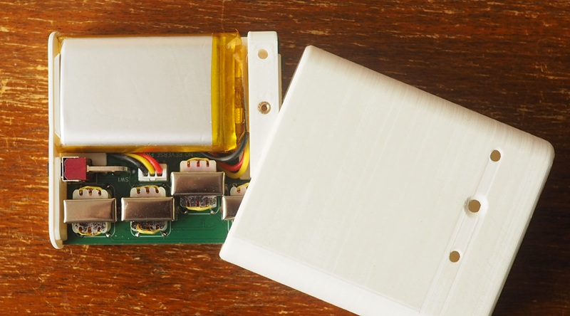

# Mainboard

Break off the side rails, lightly scrub the sides of the board with sandpaper to remove any burrs.

Snip off the middle pins of the 4 transformers, bend the metal tabs in.

Solder the transformer to the unpopulated side of the board. The orientation is important!

Solder the battery connector and switch to the unpopulated side of the board.

> [!CAUTION]
> Not all batteries have the same pinout. Connecting a battery with the wrong pinout will
> destroy your board.

# Frontpanel

> [!NOTE]  
> Make sure to solder the frontpanel components to the correct side

Solder the SMD nuts and the pin headers to the rear of the frontpanel.

When soldering the SMD nuts, do not put solder on the front. 
Check if the SMD nuts are roughly centered in their holes.

Solder the 2.54mm pins to the display.  
Place the display and frontpanel into the assembly fixture and solder the parts together.

Snip the pins of the display short (both sides).  
If the frontpanel contacts the mainboard front edge completely, you have trimmed the pins enough.

Solder the pot. 

# Case

Print the case. No supports needed if printing at .2 layer height.

TODO: print instructions.

Install the M3 heatset inserts.

TOOD: image showing this assembly step.

Attach the feet.

TODO: wait for feet to arrive and make pictures

# Assembly

Insert the frontpanel into the case and tighten the 2mm banana jacks.
The best tool for grabbing onto the jacks is a small torx bit, just jam it into the hole.

Combine the mainboard, battery tray and rear by sliding the parts together.   
Insert the battery connector and neatly fold the battery cable under. 

> [!CAUTION]
> Do not pinch the battery cable against the sharp edges of the switch.

Slide the whole assembly into the case. Tighten the screw on the bottom to lock the assembly.

The extra holes can be used for a belt clip (todo: design).

# Disassembly

Remove the screws from the bottom. Shake the case and the mainboard should slide out.  
If this does not work you can push the board out with a small allen key through the 2mm jacks
or by driving a long M4 bolt into one of the holes.

Remove the 2mm jacks with a small torx bit.