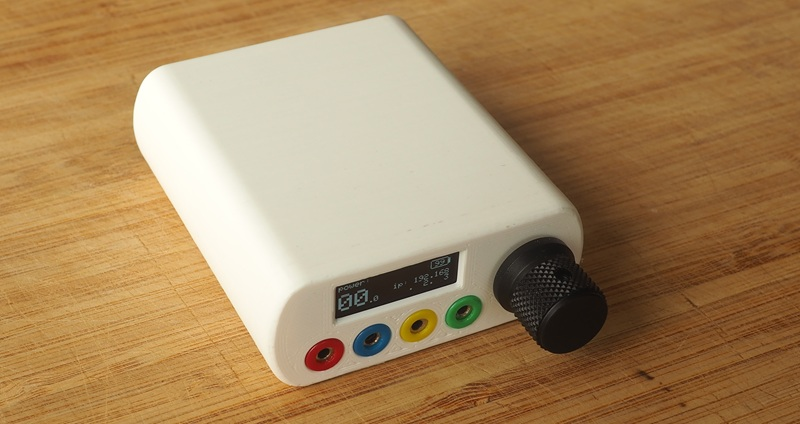

# Mainboard

Break off all the side rails, you can use some sandpaper to remove the sharp edges.

Snip off the middle pins of the 4 transformers, bend the metal tabs in.

Solder the transformers to the unpopulated side of the board, 
you have to bend the pins to fit into the holes.

The orientation is important! The genuine Xicon 42TL004 are clearly marked
with a 'P' and black sharpie mark on top.

With other transformers, the low-voltage side (1 ohm) is on the inside,
and the high-voltage side (10-40 ohm) is on the edge of the board.
The high-voltage side goes directly to the 4-pin on the frontpanel.

Solder the battery connector and switch to the unpopulated side of the board.

> [!CAUTION]
> Not all batteries have the same pinout. Connecting a battery with the wrong pinout will
> destroy your board.
> 
> The correct orientation of the battery connector depends on your battery pinout,
> compare your battery with the `+ -` printed on the PCB. 
> The image shows the most common pinout.

# Frontpanel

> [!NOTE]  
> Make sure to solder the frontpanel components to the correct side

> [!NOTE]  
> Follow this assembly order

Solder the SMD nuts to the rear of the frontpanel.

Place the nut into the hole and add some solder around the edges,
then heat up the nut to melt the solder on both sides to flow the nut into place. 
A good mechanical connection is important. When in doubt, a bit of solder
can be added on the other side.

Use a hot air station or hot plate if you have one.

Solder the 2.0mm connectors to the same side and test fit. 

Solder the 2.54mm pins to the display.  
Place the display and frontpanel into the assembly fixture and solder the parts together.

Snip all pins of the display short (both sides) for clearance. Protect your eys from the flying pins!

Snip off the very corner of the display for clearance in the case.

Solder the encoder and you're done.

# Case

Print the case. No supports needed if printing at .2 layer height.

TODO: print instructions.

Install the M3 heatset inserts in the battery sled.

TOOD: image showing this assembly step.

Attach the feet.

TODO: wait for feet to arrive and make pictures

# Assembly

Insert the frontpanel into the case and tighten the 2mm banana jacks.
The best tool for grabbing onto the jacks is a small torx bit, just jam it into the hole.

The order is be red - blue - yellow - green.

Jacks should be a loose fit, if they are extremely tight you may delaminate the
frontpanel during tightening.

Combine the mainboard, 3D-printed battery sled and rear by sliding the parts together. 

Insert the battery connector and fold the cable under the battery. 

> [!CAUTION]
> Do not pinch the battery cable against the sharp edges of the switch.

Slide the whole assembly into the case. Tighten the single screw on the bottom to lock the assembly.

The extra holes can be used for a belt clip (todo: design).

# Disassembly

Remove the screws from the bottom. Shake the case and the mainboard should slide out.  
If this does not work you can push the board out with a small allen key through the 2mm jacks
or by driving a long M4 bolt into one of the holes.

Remove the 2mm jacks with a small torx bit.