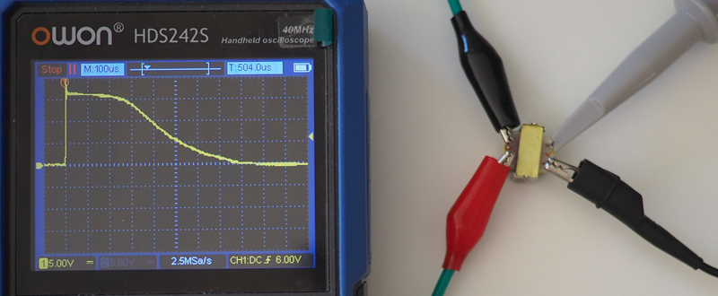

# Transformer limits

## Specifications

The maximum output the device can deliver is limited by the saturation
of the transformer core, unit volt-seconds. It can be tested easily
with an oscilloscope and power supply:

The area under the curve is about $7500 V*µs$, 
which is the saturation point of the small 42TL004. 
It could be argued $6000 V*µs$, 20% less, is the practical limit
for undistorted waveforms.

For the larger 42TU200 used in the V1, multiply these numbers by 4.

## Charge delivery limits

The fundamental quantity of nerve activation is charge, unit Coulomb, 
aka current-seconds. The maximum charge the transformer can deliver
depends on the skin resistance and 
the transformer DC resistance ($12 Ω$ for the small 42TL004). 

For the FOC, the relevant figure is the skin resistance because
each path goes through 2 transformers. 
Most e-stim boxes have one transformer per path, 
calculations have to be performed
with the body resistance (twice the skin resistance).

| skin resistance (one-way) | example                                                              | maximum charge $7500Vµs / (12Ω + xΩ)$ | Practical limit 80% |
|------------------------------:|----------------------------------------------------------------------|------------------------------------------:|------------------------:|
|                          25 Ω | Large metal insertable                                               |                                    202 µC |                  161 µC |
|                          50 Ω | Electro-rings (metal)                                                |                                    121 µC |                   97 µC |
|                         100 Ω | Double-wrap of 8mm conductive rubber with metal core below balls |                                     67 µC |                   54 µC |
|                         140 Ω | Glans loop with 8mm conductive rubber,  3x3cm rubber pad         |                                     49 µC |                   39 µC |
|                         200 Ω | Year-old rubber loops, regularly used                                |                                     35 µC |                   28 µC |
|                         250 Ω | Industry standard testing value,  3x3cm sticky pad               |                                     29 µC |                   23 µC |
|                         500 Ω | ?                                                                    |                                     15 µC |                   12 µC |
|                        1000 Ω | some conductive rubber insertables                                   |                                    7.4 µC |                  5.9 µC |

Measurements performed with varying carrier frequency.

The maximum signal intensity I use is about 5µC, but there is a catch: 
the lower the signal frequency, the more charge is needed to get an effective
signal intensity of 5µC. The correction factor is $1 + \frac{pulsewidth}{355µs}$.

| frequency (Hz) | correction factor | required charge for 5µC signal intensity | waveform aplitude for 5µC signal intensity |
|----------------|-------------------|---------------------------------------------:|-----------------------------------------------:|
| 500            | 3.82              |                                      19.1 µC |                                          60 mA |
| 1000           | 2.41              |                                      12.1 µC |                                          76 mA |
| 1500           | 1.93              |                                       9.7 µC |                                          91 mA |
| 2000           | 1.70              |                                       8.5 µC |                                         106 mA |

## Verification

I tested a resistor network representing bad quality rubber (three $500 Ω$ resistors in star network). 
According to our calculations the maximum charge delivery should be $15 µC$.

With 1000hz waveforms, the waveforms look perfect on the scope up to an amplitude of $76mA, 12 µC$.
At higher signal intensities the waveform starts to look a bit distorted. 
This confirms the practical output limit is about 80% of the transformer saturation point.

# Drive circuit limits

The FOC v4 has an internal voltage of $30V$ and $220µH$ inductors. 
For technical reasons, the maximum driving voltage (relative to the circuit virtual neutral)
is about $10V$.

With the winding ratio of the 42TL004 
(6.66 according to the datasheet, but about 5.5 according to my own measurements), 
the maximum voltage amplitude is $55V$ to neutral or $110V$ output-to-output.

With $500 Ω$ skin resistance, the maximum output current is approx $110mA$.
The tables show this limits the maximum frequency to about $2000Hz$ for a $5µC$ signal intensity.

# Boost circuit limits

With a full battery, the boost circuit in V4 can deliver 4 watt of power (average),
a bit less when the battery is nearly empty.

With good quality rubber electrodes, I use about 0.3w in threephase. 

# Conclusions

We can infer that with the industry standard resistor ($250 Ω$ skin resistance), 
the small transformer is capable of reaching my maximum tolerable signal strength at
$500Hz$, and double that at $1000Hz$ and above.

With a skin resistance of $500 Ω$, meaning $1000 Ω$ total body impedance, 
frequencies above $1000Hz$ have to be used to overcome transformer saturation
and below $2000Hz$ for the drive circuit.

It remains to be seen how applicable these assumptions (skin resistance and signal intensity)
are to a wider audience.