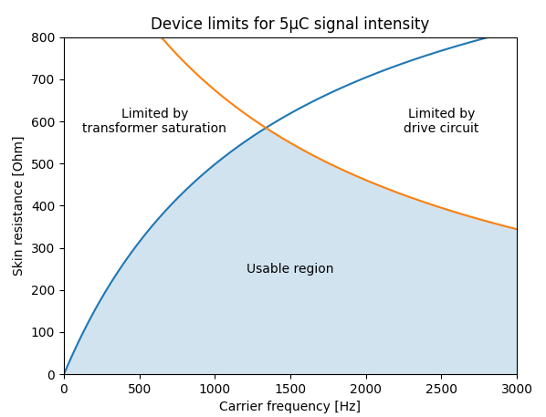

# Introduction

The maximum output the FOC-Stim V4 can deliver depends on the skin resistance.

With which skin resistance can the device still blow your socks off?
The answer is approximately $500 \Omega$.

# Skin resistance?

I like using the skin resistance instead of the body resistance,
as the basic concept of body resistance starts to become fuzzy with more
than 2 electrodes. In most cases, skin resistance * 2 = body resistance.

I collected some data under various circumstances:

| skin resistance (one-way) | example                                                  |
|------------------------------:|----------------------------------------------------------|
|                          25 Ω | Large metal insertable                                   |
|                          50 Ω | Electro-rings (metal)                                    |
|                         100 Ω | Double-wrap of 8mm conductive rubber below balls |
|                         140 Ω | Glans loop with 8mm conductive rubber,  3x3cm rubber pad |
|                         200 Ω | Year-old rubber loops, regularly used                    |
|                         250 Ω | Industry standard testing value,  3x3cm sticky pad   |
|                         500 Ω | ?                                                        |
|                        1000 Ω | mystim brand conductive rubber insertables               |

Most electrodes fall well within the usable region.

# Appendix

## Assumptions

The Xicon 42TL004 is limited to $`7500 V*\mu s`$ output before complete 
saturation, in practice $`6000 V*\mu s`$ is about the max for
undistorted waveforms. The winding ratio is 5.5.

The FOC-Stim V4 drive circuit is limited to $30V$. For technical
reasons, the effective voltage-to-neutral is a bit less than half that,
I use a conservative limit of $10V$. This results in an output-to-output
voltage of $110V$.

The maximum signal intensity I use is a bit less than $5\mu C$. 
I used this number as a benchmark.

The FOC V4 boost circuit can deliver about 4W of power. 
This is assumed to be not a limitation.

The device $\frac{dI}{dt}$, current sense range, control loop bandwidth
and transformer specifications all start to become problematic around
$3000Hz$ to $5000Hz$.

Time constant of the nerves is $355\mu s$

## Math

$Q_0 = 5 \mu C$, the maximum tolerable signal intensity.

$Q_t = Q_0 \times (1 + \dfrac{\text{pulsewidth}}{355\mu s})$, the amount of charge we 
actually have to deliver to get the maximum signal intensity.

$Q_t = \pm \dfrac{I_{\text{peak}}}{2 \times \pi \times \text{frequency}}$, minimum and maximum charge in sine wave signal.

$R = \dfrac{Vs}{Q_t}$, link transformer saturation to resistance and charge.

$R = \dfrac{10V \times \text{winding ratio}}{I_{\text{peak}}}$, ohms law assuming inductance is negligible. 

It follows that the maximum resistance before we run into 
transformer saturation is:

$R = \dfrac{6000V\mu s}{5\mu C \times (1 + \dfrac{1}{2 \times \text{frequency} \times 355\mu s})}$

And the maximum resistance before the drive circuit maxes out is:

$R = \dfrac{10V \times \text{winding ratio}}{5\mu C \times \pi \times (\text{frequency} \times 2 + \frac{1}{355\mu s})} - \text{drive circuit resistance}$

The drive circuit resistance is about $1.75 \Omega \times \text{winding ratio}^{2}$