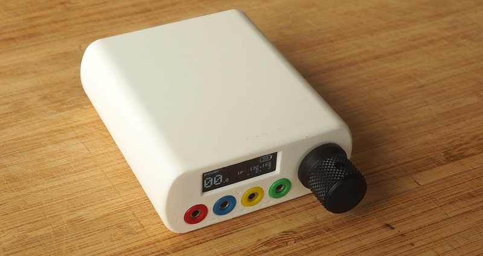

Schematics, PCB and case design by Sekizen.  
Software by Diglet.

# Specifications

* Three and four-phase output capability.
* 7-hour battery life with typical electrodes.
* Wireless communication (Wifi).
* Small display for diagnostics, knob for volume adjustments.
* Built-in accelerometer.
* Optional external sensors for nogasm/edge-o-matic functionality.

# Useful pages

* [Schematics / Gerbers](/schematics/V4/readme.md)
* [Bill of materials](focstim-v4-BOM.md)
* [3D files](/3d%20files/V4)
* [Assembly guide](focstim-v4-assembly.md)
* [Flashing your board](focstim-v4-flashing.md)
* [AS5311 sensor](as5311%20sensor.md)

# Nerd zone

* [Output specifications](focstim-v4-output-specifications.md)

# Changelog

## V4.3
Replace C6 (SYSSense) and C20 (VMSense) from 100nF to 10nF.  
Improve thermal relief on some hard-to-solder ground pads on mainboard and frontpanel.

## V4.2
Added LSM6DSOX 6-DOF IMU.  
Added cutout for ESP32 antenna.  
Change the part number of the boot buttons to save space.  
Change the part number of the boost inductor due to parts shortage.  
Add ground spokes to some solder pads.  
Modified board outline to reduce abrasion on frontpanel.

## V4.1
Initial public version.  
Changed most pin assignments on the ESP32.  
Adjust switch circuit to avoid inrush current killing the TSP631000.  
Modify frontpanel dimensions for extra creepage/clearance.  

## V4.0
Not publicly released, switched to DRV8231A drivers.

## V3.0
Not publicly released, based on MAX22213 drivers.